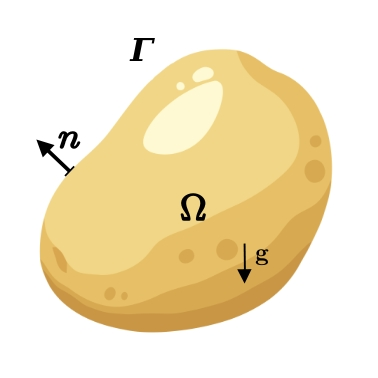
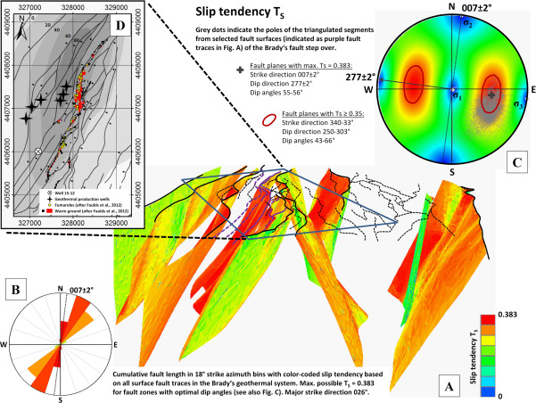
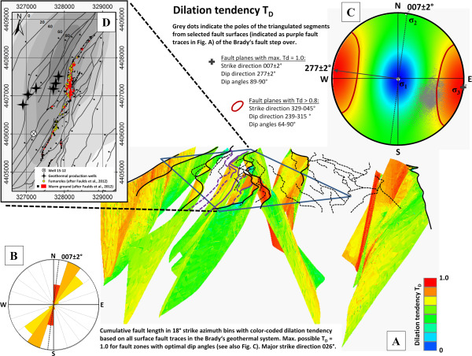
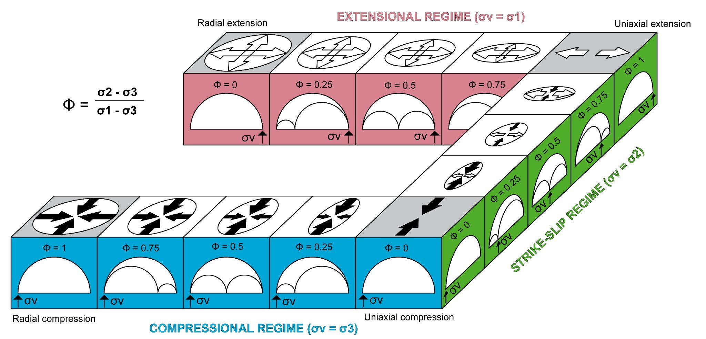

Theory
======

1. Mechanical models
--------------------

1.1 Mechanical problem
^^^^^^^^^^^^^^^^^^^^^^

Let :math:`\Omega_t \subset R^3` be the spatial domain at time :math:`t`.
The mechanical problem in the quasi-static regime consists in finding the velocity field :math:`\dot u(t,x)` and the stress field :math:`\sigma(t,x)` solutions of:

        :math:`\mathbf{\sigma} + \rho\mathbf{g} = 0 \in \mathbf{\Omega}_t`,

        :math:`\frac{D\mathbf{\sigma}}{Dt}= \mathcal{M}(\mathbf{\sigma} (t),\mathbf{d},\dots )`  \in :math:`\mathbf{\Omega}_t`,

        :math:`\dot u = \dot u_0 \text{ on }  \Gamma_{u,t} ,` and :math:`\mathbf{\sigma}\cdot \mathbf{n} = F_0 \text{ on } \Gamma_{\sigma, t}`.

In this set of equations, :math:`\rho` is the density, :math:`\mathbf{g}` the vector of gravity acceleration, :math:`\mathbf{d}=\frac{1}{2}(\nabla \dot u + \nabla \dot u^T)`  the strain rate tensor, also written as :math:`\mathbf{\dot \epsilon}(t),  \Gamma_{u,t}` and :math:`\Gamma_{\sigma , t }` are parts of the boundary with a given velocity :math:`(\dot u_0)` and the traction vector (:math:`F_0`), and :math:`\frac{D\sigma}{Dt}` is an objective time derivative of :math:`\sigma` (Jaumann rate)  defined as:

         :math:`\frac{D\sigma}{Dt}=\dot \sigma - \omega \sigma + \sigma \omega`,  with :math:`\omega = (\nabla v − \nabla v^T)` the corotational rate tensor.

 :math:`\mathcal{M}` represents a functional constitutive law that corresponds to an elastic, elasto-plastic or elasto-visco-plastic rheology defined as:

         :math:`\mathcal{M}(\mathbf{\sigma}, \mathbf{d}, \mathbf{d_p}) = 2G ( \mathbf{d}-\mathbf{d_p}) + \lambda  tr( \mathbf{d}-\mathbf{d_p}) \mathbf{I} -\frac{G}{\eta} \mathbf{dev \sigma}`,

where :math:`{\mathbf{d_p}}` is the plastic part of  :math:`\mathbf{d}`, :math:`\mathbf{I}` is the identity tensor, :math:`tr` the trace operator, :math:`G` and :math:`\lambda` are the Lamé parameters and :math:`\eta` is the viscosity.  :math:`\mathbf{dev \sigma}` is the deviatoric part of :math:`\mathbf{\sigma}`.

1.2 Elastic, viscous and plastic rheologies
^^^^^^^^^^^^^^^^^^^^^^^^^^^^^^^^^^^^^^^^^^^

Various elasto-visco-plastic rheologies can be accounted for numerically. The Drucker-Prager shear failure criterion and the tensile failure criterion are commonly used to define plastic yielding, and are defined with a friction angle `φ`, a cohesion `C`, and a tensile strength :math:`T` leading to the following yield envelopes:

     :math:`{f}_{DP} =J(\mathbf{s}) + \alpha {I}_{1} - {p}_0`  and   :math:`{f}_{T} ={I}_{1} - T`,

where :math:`{I}_{1}=tr(\mathbf{\sigma})` is the first invariant of the stress tensor and :math:`J(\mathbf{s})` is the second invariant of the deviatoric stress tensor, with :math:`\mathbf{s}=\mathbf{\sigma}-p` and :math:`p` is the mean stress (or pressure). The same invariants characterize the strain tensor :math:`\mathbf{\varepsilon}`.  Conventionnally, negative stress and strain values correspond to compression and "shortening". Parameters  :math:`\alpha=\frac{6sin \phi}{3-sin \phi}` and :math:`p_0=\alpha.C.tan \phi`.

The plastic part of the strain rate tensor   :math:`\mathbf{d_p}=\mathbf{d}-\mathbf{d_e}` is given by the non-associative flow rule:

     :math:`\mathbf{d_p} = \lambda_p \cdot \frac{\partial G(\sigma)}{\partial \sigma}`, and :math:`G(\sigma) = J(\sigma) + \frac{6sin\psi}{3-sin\psi} \cdot I_1(\sigma)`,

where :math:`G`  is the plastic potential, :math:`\psi` is the dilatancy angle, and :math:`\lambda_p` is the plastic multiplier.

Maxwell visco-elasticity in turn relates the deviatoric stress :math:`s` and the strain rate :math:`d`. The effective viscosity obeys a power law rheology, where the viscous deviatoric strain rate corresponds to:

      :math:`d_v = \gamma_0 \cdot J(s)^{n-1} \cdot e^{\frac{Q-LV}{RT}} \cdot s`,

where :math:`\gamma_0` is the initial fluidity, the inverse of a non-linear viscosity. :math:`T` is the absolute temperature at the onset of the model, :math:`R` is the ideal gas constant, and :math:`Q`, :math:`L` and :math:`n` are material activation energy, activation volume and power-law exponent.

1.3 Numerical implementation with ADELI
^^^^^^^^^^^^^^^^^^^^^^^^^^^^^^^^^^^^^^^

ADELI  (Hassani et al.,1997, Chery et al., 2001) is a 3D Finite Element algorithm developed to solve the differential equations of quasi-static equilibrium and mass conservation using a time-explicit dynamic Relaxation Method (Cundall & Board, 1988). This method is well known for being able to track the onset and the development of localized elasto-plastic deformation. ADELI has been widely used to simulate a variety of tectono-volcanic and geodynamic settings (e.g., Cerpa et al, 2015, Gerbault et al., 2018, Ruz-Ginouves et al., 2021, Novoa et al. 2019, 2022).

The three-dimensional space is discretized with tetrahedra, forming an unstructured mesh generated using the `GMSH <https://www.gmsh.info>`_ software (Geuzaine and Lemacle, 2009).

More details regarding the equations and method can be found in eg. Chery et al. (2001) or Cerpa et al. (2015).

1.4 Other mechanical approaches: eg. FEniCS
^^^^^^^^^^^^^^^^^^^^^^^^^^^^^^^^^^^^^^^^^^^
Sáez-Leiva et al. (2023) addressed the first-order, time-dependent control that an active strike-slip crustal fault can exert on a nearby geothermal reservoir, by implementing a poro-elasto-plastic Finite Element Method (FEM) based on the Python opensource library FEniCS (Alaes et al., 2015).

As fluid flow plays a crucial role in the development of numerous geological processes (i.e. :math:`CO_2` injection, hydraulic fracturing, magma intrusion, among others), it
needs to be taken into account when modelling deformation in the crust. Even though most fluid flow in the upper crust goes through fracture networks, approximation
through Darcy's law for porous media is a quite used approach in the poromechanics community and, is the assumption taken in our formulation. With absence of gravity, fluid flow in a porous medium can be described as the following:

    :math:`\mathbf{q}(p) = -\frac{\kappa}{\mu} \nabla{p}`

The solid matrix is modeled as a elasto-plastic solid in which plasticity is implemented considering an additive decomposition of the strain tensor:

    :math:`\varepsilon = \varepsilon^{elas} + \varepsilon^{plas}`,

then an incremental constitutive law is used to define a variation of the Cauchy stress tensor :math:`\Delta \sigma`:

    :math:`\Delta \sigma = \mathcal{D}^{elas}:\Delta \varepsilon^{elas} + \mathcal{D}^{plas}:\Delta \varepsilon^{plas}`,

where :math:`\mathcal{D}^{elas}` and :math:`\mathcal{D}^{plas}` are the elastic and elasto-plastic tangent operators.

Considering these two domains, a fully-coupled poro-elasto-plastic formulation is implemented, considering solid and fluid as a continuum that satisfies the two main equations of mass balance and Darcy flow, which are solved for solid displacement :math:`\mathbf{u}` and fluid pressure :math:`{p}`. 
The Python library FEniCS provides a framework to solve Partial Differential Equations through the Finite Element Method. FEniCS allows this by solving the weak form which, in this case, correspond to mass and momentum conservation:

    :math:`\alpha \int_{\Omega} (\epsilon_v (\mathbf{u}^{t+1}) - \epsilon_v (\mathbf{u}^t))\cdot \psi + \frac{1}{M} (p^{t+1} - p) \cdot \psi + div (\mathbf{q}(p^{t+1}) \Delta t \cdot \psi d\Omega = 0`
   
    :math:`\alpha \int_{\Omega} \sigma ^{t+1} : \varepsilon(\eta) d\Omega - \int_{\partial \Gamma_{t}} \sigma n \cdot \hat{n} d\Gamma = 0`

These equations where reworked for the FEniCS implementation, which was solved by Newton's method using the tangent operators described before. More details can be found in Sáez-Leiva et al. (2023).

A poroelastic `FEniCSx <https://fenicsproject.org>`_ (the current version of the FEniCS Project) code is currently under development.

2. Geological framework (José)
------------------------------

3. Slip and Dilation Tendencies (Cécile)
----------------------------------------

Slip and Dilation Tendency analyses are used to assess the potential for fault reactivation, slip, or fluid flow in rock masses. It is used in geothermal energy, hydrocarbon extraction, CO₂ sequestration, and mining to evaluate the stability of faults and fractures under stress changes (e.g. Barton & Zoback, 1994; Ritz and Taboada, 1993; Morris et al., 1996;  Zoback, 2007; Jolie et al., 2015).
This method is often visualized using stereonets (stereoplots), which are projections of geological data (like fault orientations) onto a 2D plane for analysis.

In Fem2Geo we inform slip and dilation tendencies obtained out of the resulting stress orientations produced element wise throughout the modeled domain, in the aim to compare them with available "real" data sets.

3.1 Definitions
^^^^^^^^^^^^^^^

* Slip Tendency (:math:`Ts`) is defined as the ratio of shear stress (:math:`\tau=\sigma_1 - \sigma_3`) to normal stress (:math:`\sigma_n`) acting on a fault plane:

                  :math:`T_s = \frac{\tau}{\sigma_n}`.

A higher :math:`Ts` means the fault is closer to slipping (reactivation). Critical slip tendency (usually 0.6–0.8) indicates potential failure under Coulomb failure  (mode II) criteria.

* Dilation Tendency (:math:`Td`) is defined as the ratio of the difference between maximum and intermediate principal stresses (:math:`\sigma₁ - \sigma₂`) to the normal stress (:math:`\sigma_n`) on a fault plane :

                  :math:`T_d = \frac{σ_1−σ_2}{\sigma_n}`.

A higher :math:`Td` means the fault is more likely to dilate (open) under stress changes, hence is more permeable to fluids.

* Stereoplots (or stereonets) are used to visualize fault/fracture orientations and their slip/dilation tendencies under a given stress regime.
Collected fault and fracture Data in the field or from logs can be represented as poles (normal vector), as points on a stereonet. For example, a fault of strike 120° and dip of 60° has its pole plotted at 30° (dip direction) and 30° (90° - dip). On the other hand the corresponding stress tensor principal components orientation can be plotted (:math:`σ₁, σ₂, σ₃`).

2.2 Combined slip and dilation tendencies and other stress ratio representations
^^^^^^^^^^^^^^^^^^

3. Krostov representations
--------------------------

4. Other probabilistic analyses tools
-------------------------------------

References
----------

Alnaes, M., Blechta, J., Hake, J., Johansson, A., Kehlet, B., Logg, A., ... & Wells, G. N. (2015). The FEniCS project version 1.5. Archive of numerical software, 3(100).

Barton, C. A., & Zoback, M. D. (1994). Stress perturbations associated with active faults penetrated by boreholes: Possible evidence for near‐complete stress drop and a new technique for stress magnitude measurement. Journal of Geophysical Research: Solid Earth, 99(B5), 9373-9390. https://doi.org/10.1029/93JB03359.

Cerpa, N. G., R. Araya, M. Gerbault, and R. Hassani, 2015: Relationship between slab dip and topography segmentation in an oblique subduction zone: Insights from numerical modeling. Geophysical Research Letters, 42 (14), 5786–5795, doi:10.1002/2015GL064047.

Chery, J., M. D. Zoback, and R. Hassani, 2001: An integrated mechanical model of the San Andreas fault in central and northern California. Journal of Geophysical Research: Solid Earth, 106 (B10), 22 051–22 066, doi:10.1029/2001jb000382.

Cundall, P., and M. Board, 1988: A microcomputer program for modeling large-strain plasticity problems. Prepared for the 6th International Congress on Numerical Methods in Geomechanics, 1988.

Gerbault, M., R. Hassani, C. Novoa Lizama, and A. Souche, 2018: Three-Dimensional Failure Patterns Around an Inflating Magmatic Chamber. Geochemistry, Geophysics, Geosystems, 19 (3),654, 749–771, doi:10.1002/2017GC007174.

Geuzaine, C., and J.-F. Remacle, 2009: Gmsh: A 3-d finite element mesh generator with built-in pre- and post-processing facilities. International Journal for Numerical Methods in Engineering,79 (11), 1309–1331, doi:https://doi.org/10.1002/nme.2579.

Hassani, R., D. Jongmands, and J. Chery, 1997: Study of plate deformation and stress in subduction processes using two-dimensional numerical modes. J. Geophys. Res., 102.

Jolie, E., Moeck, I., & Faulds, J. E. (2015). Quantitative structural–geological exploration of fault-controlled geothermal systems—a case study from the Basin-and-Range Province, Nevada (USA). Geothermics, 54, 54-67. https://doi.org/10.1016/j.geothermics.2014.10.003.

Morris, A., Ferrill, D. A., Henderson, D. B. (1996). Slip-tendency analysis and fault reactivation. Geology, 24(3), 275-278. DOI: 10.1130/0091-7613(1996)024<0275:STAAFR>2.3.CO;2

Novoa, C., and Coauthors, 2019: Viscoelastic relaxation : A mechanism to explain the decennial large surface displacements at the Laguna del Maule silicic volcanic complex. Earth Planet. Sci. Lett., 521, 46–59, doi:10.1016/j.epsl.2019.06.005.

Novoa, C., and Coauthors, 2022: The 2011 Cordon Caulle eruption triggered by slip on the Liquine-Ofqui fault system. Earth and Planetary Science Letters, 583, doi:10.1016/j.epsl.2022.117386.

Ritz, J. F., & Taboada, A. (1993). Revolution stress ellipsoids in brittle tectonics resulting from an uncritical use. Bull. Soc. Geol. France, 64(4), 519-531.

Ruz Ginouves, J., M. Gerbault, J. Cembrano, P. Iturrieta, F. Saez Leiva, C. Novoa, and R. Hassani, 2021: The interplay of a fault zone and a volcanic reservoir from 3D elasto-plastic models: Rheological conditions for mutual trigger based on a field case from the Andean Southern Volcanic Zone. Journal of Volcanology and Geothermal Research, 418, doi:10.1016/j.jvolgeores.2021.107317.

Sáez-Leiva, F., Hurtado, D. E., Gerbault, M., Ruz-Ginouves, J., Iturrieta, P., & Cembrano, J. (2023). Fluid flow migration, rock stress and deformation due to a crustal fault slip in a geothermal system: A poro-elasto-plastic perspective. Earth and Planetary Science Letters, 604, https://doi.org/10.1016/j.epsl.2023.117994.

Zoback, M. D. (2007). Reservoir Geomechanics. Cambridge University Press.