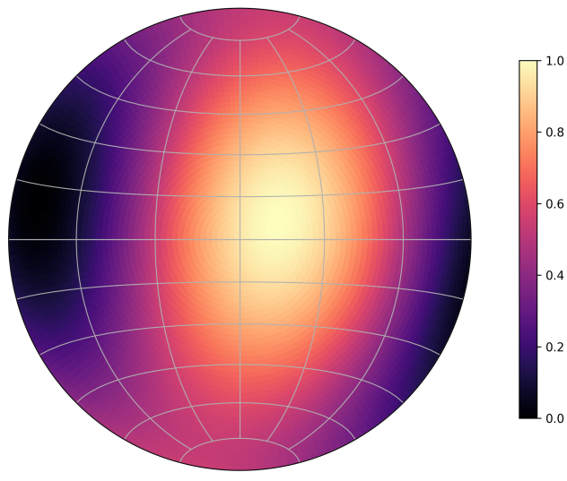

.. _user_guide:

User Guide
==========

Overview
--------

``fem2geo`` is a tool for structural geology analyses on the output of FEM
and BEM models. The workflow has the same shape for most analyses:

1. **Load a model** from a solver output file (usually a ``.vtu``).
2. **Extract a region** of the model — a sphere around a point of interest.
3. **Compute** a geomechanical quantity from the tensors inside that region: principal directions, slip or dilation tendency, resolved shear, etc.
4. **Load data** from a table, rasters, shapefiles or an additional ``.vtu``.
5. **Plot** the result, usually on a stereonet, and optionally save the
   extracted region as a ``.vtu`` file for inspection in Paraview.

There are two ways to drive this workflow. The main way is a YAML config
file run from the command line, which is what the tutorials cover. The
other is Python scripting, which is useful for advanced exploration and custom
analyses (See Jupyter notebooks)

Model Data
----------

A model is a mesh of cells, each carrying the physical quantities produced
by the solver: stress and strain tensors, displacement, velocity, plastic
strain, and so on.

Different solvers use different array names. A stress tensor could be stored as six separate
scalars (``Stress_xx``, ``Stress_yy``, …), or packed as a single Voigt array (``stresses_(Pa)``),
or already decomposed into principal values and directions. The **schema** maps these
solver-specific names to a single set of **canonical names** that ``fem2geo`` uses everywhere.
Once a model is loaded with the right schema, ``fem2geo`` can work with the model.

``fem2geo`` ships built-in schemas. For other solvers, writing a YAML file is required, which
can be easily derived from existing schemas.

Stereonets
----------

Most ``fem2geo`` plots are stereonets. A stereonet is a flat disc that shows the lower half of a
sphere, seen from above.

.. figure:: ../_static/user_guide/lines.png
   :alt: Projecting a line onto a stereonet
   :width: 80%
   :align: center

   A line through the centre of the sphere hits the bowl at one point.
   Projecting that point in the horizontal, gives a line in the stereonet (right). A line is
   defined by a trend (:math:`\alpha`) and plunge (:math:`\beta`).

``fem2geo`` uses the **lower-hemisphere equal-area (Schmidt)
projection**. North is at the top, azimuth goes clockwise, the edge of
the disc is horizontal, and the centre is straight down. Three kinds of things show up on a
stereonet.

**Points** are lines. A principal stress direction, the pole of a
plane, a slip vector — each is one point.

**Great circles** are planes. A fault or a fracture plane is drawn as
a curve running from edge to edge. The pole of the plane is the point
90° away from the curve.

.. figure:: ../_static/user_guide/planes.png
   :alt: A plane as a great circle on a stereonet
   :width: 80%
   :align: center

   A plane in 3D is one curve on the disc. A plane is
   defined by a strike (:math:`\rho`) and dip (:math:`\delta`).

**Shaded fields** are scalar fields that depend on orientation.

   For every possible line orientation, a colour shows the value of the scalar field.

Conventions
-----------

Model frame
^^^^^^^^^^^

The model lives in a right-handed Cartesian frame:

    - **X = East**, **Y = North**, **Z = Up**.
    - Projected Coordinate Reference Systems (CRS), such as UTM19S, etc. In this cases, depth
      is usually also in meters.

Units are whatever the solver used. ``fem2geo`` does not rescale. When extracting a sub-region from a model
site centres and radii must be in the same units as the model.

If the model or data is georeferenced (data in lon/lat, a model in projected CRS, a DEM), the
``project`` job reprojects it into this frame first.

Stress and strain
^^^^^^^^^^^^^^^^^

In most models, stresses and strains follow the continuum mechanics sign convention, with
tension and extension taken as positive. This is in contrast to a geomechanical convention, where
compression/contraction have negative sign.

Internally, ''fem2geo'' assumes:

- **Compression is negative.** A uniaxial compression along X gives a
  negative ``stress[0, 0]``. Shortening is negative in strain.
- Principal values and directions are sorted in **ascending order**. Index
  0 is the most compressive (stress) or most shortening (strain), index 2
  is the least.

However, the resulting stereoplots are always in geomechanical convention, to be consistent with
the geological literature. For instance :math:`//sigma_1` is the most compressive stress and
:math:`//epsilon_1` is the most contractional strain.

.. note::

    Shear components are given as tensor quantities (:math:`\epsilon_{ij}`, :math:`\sigma_ij`),
    not engineering shear (:math:`\gamma_{ij}`).

Planes and lines
^^^^^^^^^^^^^^^^

- **Strike** is measured clockwise from North, in degrees. Dip falls to
  the right of the strike direction (right-hand rule).
- **Dip** is the steepest angle of the plane, 0 (horizontal) to 90
  (vertical).
- **Rake** follows the Aki & Richards convention: measured from the
  strike line along the fault plane, signed.
- **Trend and plunge** describe lines. Trend is the azimuth from North,
  plunge is the downward angle from horizontal.

CSV data
^^^^^^^^

Structural CSVs have named columns:

- Fractures need ``strike`` and ``dip``.
- Faults need ``strike``, ``dip``, and ``rake``.
- Catalogs need ``longitude``, ``latitude``, and ``depth`` by default; the column names are
  configurable.

Configuration files
-------------------

The core usage of ``fem2geo`` is through configuration files. These define the standardized
functionality of the package, which allows reproducibility of the analyses.

A config file looks like this:

.. code-block:: yaml

   job: principal_directions
   schema: adeli3
   model: ../data/reverse_fault.vtu
   site:
      center: [10000, 5000, -2500]
      radius: 200
   output:
     dir: ./

Run it from the command line:

.. code-block:: console

   $ fem2geo basic.yaml

Paths inside the config are relative to the config file, so you can move a
config and its data around together without breaking anything. Every config has the same
top-level keys. Most are shared across jobs.

job
^^^

The analysis to run. One of:

- ``principal_directions`` — principal stress or strain directions at a
  site. See :ref:`principal-directions`.
- ``fracture`` — compare fracture measurements against model principal
  directions. See :ref:`fracture`.
- ``resolved_shear`` — compare observed fault slip against
  model-predicted slip. See :ref:`resolved-shear`.
- ``kostrov`` — compare a Kostrov moment tensor from faults against the
  model tensor. See :ref:`kostrov`.
- ``tendency`` — slip, dilation, or summarized tendency fields. See
  :ref:`tendency`.
- ``sites.<inner>`` — run any of the above over several sites at once on
  one figure, e.g. ``sites.tendency``, ``sites.fracture``. See :ref:`multi_sites`.
- ``project`` — reproject georeferenced data into the model's local
  frame. See :ref:`projections`.

schema
^^^^^^

Maps solver-specific array names to canonical names. Pick a built-in:

# TODO: well-define latest adeli schema.

model
^^^^^

Path to the solver output file, usually a ``.vtu``. Relative to the
config.

tensor
^^^^^^

Which tensor the analysis should use. Jobs that work on tensor data
accept:

- ``stress`` — total Cauchy stress.
- ``stress_dev`` — deviatoric stress.
- ``strain`` — total strain.
- ``strain_rate`` — strain rate.
- ``strain_plastic`` — plastic strain.
- ``strain_elastic`` — elastic strain.

site (or sites)
^^^^^^^^^^^^^^^

Where on the model the analysis happens. A site is a sphere, with a
centre and a radius:

.. code-block:: yaml

   site:
     center: [10000, 5000, -2500]
     radius: 200

The radius controls how many cells the tensor is averaged over. Smaller
radius, more local. Larger radius, smoother average. Jobs that compare
against structural data also carry a ``data`` key with a CSV path:

.. code-block:: yaml

   site:
     center: [10000, 5000, -2500]
     radius: 500
     data: ../data/fractures.csv

For multi-site runs, use ``sites`` and list them by name:

.. code-block:: yaml

   sites:
     north:
       center: [10000, 8000, -2500]
       radius: 500
     south:
       center: [10000, 2000, -2500]
       radius: 500
       title: "Southern block"

plot
^^^^

Everything that controls how the figure looks: title, figure size, DPI,
legend size and location, colors and marker sizes for each element. The
exact keys depend on the job — every job documentation page lists its
own plot block in full.

output
^^^^^^

Where to save results.

.. code-block:: yaml

   output:
     dir: results/
     figure: my_plot.png
     vtu: extract.vtu

The folder is created if it does not exist. The ``figure`` key is
optional; each job has a default filename. The ``vtu`` key is optional
too; when present, the extracted sphere is saved so it can be opened in
Paraview.

Python API
----------

Everything above can be done directly from Python, without a config file.
This is the path for exploration, custom plots, and analyses that do not
fit any of the built-in jobs.

The Python API is covered in the notebook tutorials (coming soon). They
walk through loading a model, extracting regions, calling the tensor
primitives directly, and embedding ``fem2geo`` stereonets inside custom
matplotlib figures.

See also
--------

- :doc:`theory` — mechanical and structural geology background.
- :doc:`../reference/api_reference` — full function reference.
