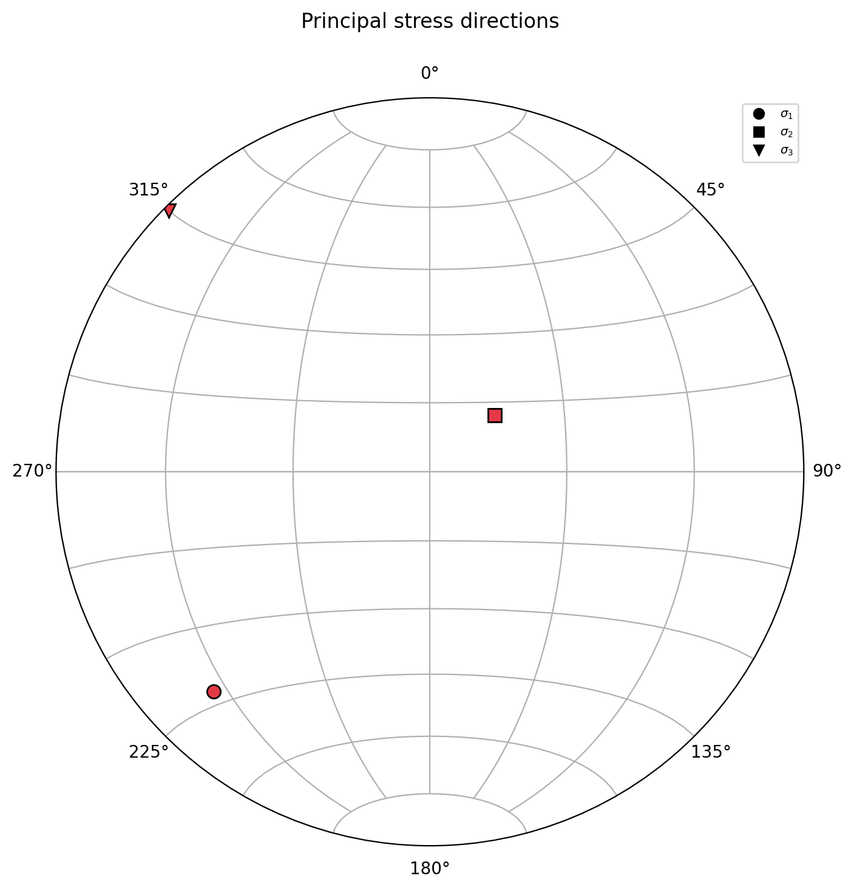
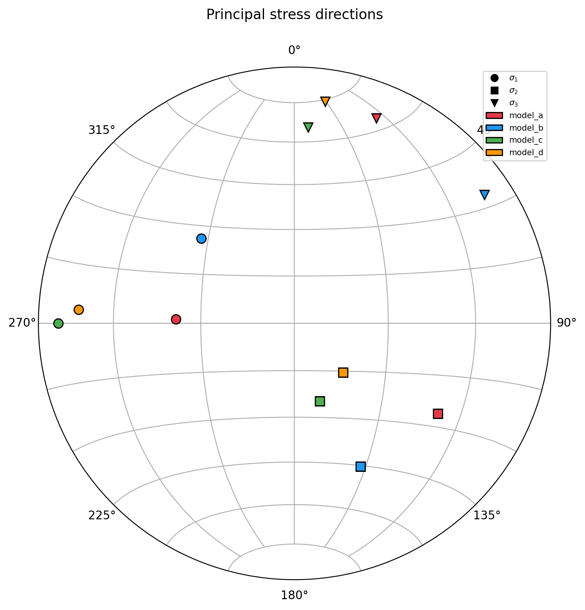
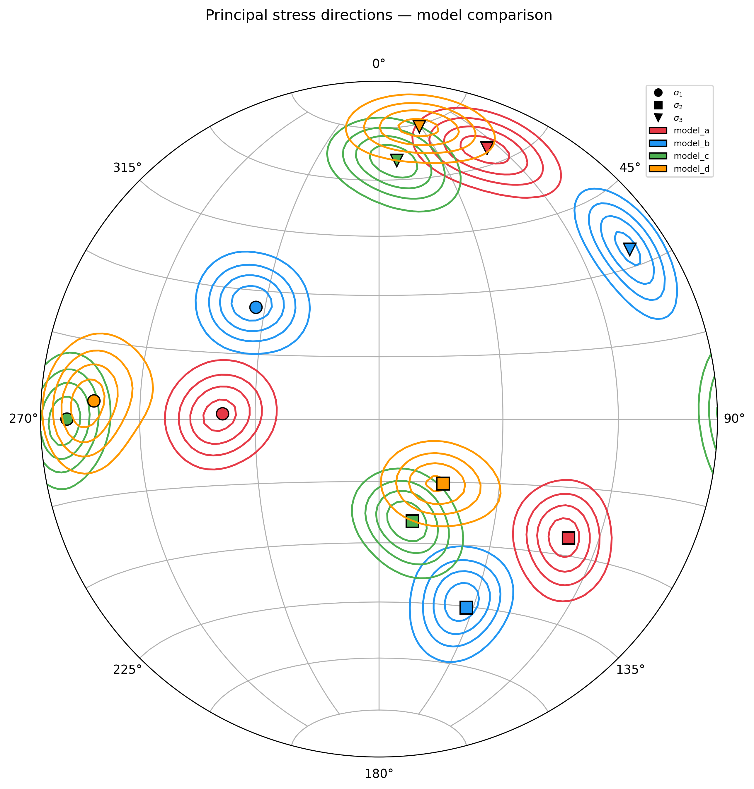

.. _principal-directions:

Principal directions
====================

This tutorial shows how to probe the stress state of a model at a selected location and
visualise the principal directions on a stereonet. The ``principal_directions`` job:

* Extracts a zone from the model.
* Averages the stress tensors from the zone cells/nodes.
* Computes the principal directions.
* Transforms them to geological line coordinates (trend and plunge).
* Plots them as :math:`\sigma_1 \leq \sigma_2 \leq \sigma_3`, where :math:`\sigma_1` is the
  most compressive stress.

Basic: One Model
----------------

A minimal configuration only needs the job name, a schema, a model file, and an
extraction zone:

.. literalinclude:: ../../../tutorials/1_probing_models/config_1.yaml
   :language: yaml

In this example:

- ``job: principal_directions`` selects the workflow.
- ``schema: adeli`` tells ``fem2geo`` how to interpret the model fields.
- ``model`` points to the input file.
- ``zone`` defines a spherical extraction region.

# todo **ADD FIGURE WITH VTU OF THE MODEL**

Run the tutorial with:

.. code-block:: console

   $ fem2geo config_1.yaml

This produces a stereonet showing the average principal directions in the
selected region.

   Average principal directions extracted from a spherical region.

Advanced: Customizing plots
---------------------------

The advanced configuration adds plotting options and displays the cell-wise
directions as scatter:

.. literalinclude:: ../../../tutorials/1_probing_models/config_2.yaml
   :language: yaml

Run it with:

.. code-block:: console

   $ fem2geo config_2.yaml

The plot now shows both the average directions and the spread of individual cell directions.
This is useful when you want to check whether the selected region is mechanically coherent or
whether the principal directions vary strongly within it.

   Spread of cell-wise directions.

Advanced: Multiple Models
-------------------------

The same analysis can be run on several models at once. In that case, replace
``model:`` with a ``models:`` block:

.. literalinclude:: ../../../tutorials/1_probing_models/config_3.yaml
   :language: yaml

Here, the same extraction zone is applied to all four models. Run the tutorial
with:

.. code-block:: console

   $ fem2geo config_3.yaml

This produces a stereonet showing the average principal directions for each
model. It is a simple way to compare whether different simulations predict
similar orientations at the same location.

   Comparison of principal directions from multiple models.

Advanced: Contours
------------------

.. literalinclude:: ../../../tutorials/1_probing_models/config_4.yaml
   :language: yaml

Run it with:

.. code-block:: console

   $ fem2geo config_4.yaml

In a multi-model comparison, contours are often clearer than scatter because
they show the directional spread without overcrowding the stereonet.

   Comparison of models, showing average directions and cell-wise directions.

Understanding the configuration
-------------------------------

Job and schema
^^^^^^^^^^^^^^

.. code-block:: yaml

   job: principal_directions
   schema: adeli

``job`` selects the analysis workflow (see other tutorials for additional jobs). ``schema`` maps
solver-specific field names into the variables expected by ``fem2geo`` (see
``fem2geo/internal/schemas/``)

Model input
^^^^^^^^^^^

Single-model analysis uses:

.. code-block:: yaml

   model: ../data/small_box.vtk

Multi-model analysis uses:

.. code-block:: yaml

   models:
     model_a: ../data/model_a.vtu
     model_b: ../data/model_b.vtu
     model_c: ../data/model_c.vtu
     model_d: ../data/model_d.vtu

Use ``model`` when you want to inspect one simulation. Use ``models`` when you
want to compare several simulations at the same extraction point. The names
``model_a``, ``model_b``, and so on are labels used in the plot legend.

Extraction zone
^^^^^^^^^^^^^^^

.. code-block:: yaml

   zone:
     type: sphere
     center: [22, 22, -7]
     radius: 0.8

The zone defines where the model is sampled. In these examples, the extraction
region is a sphere. This is usually the most important block to adjust:

- move ``center`` to probe a different location,
- reduce ``radius`` for a more local measurement,
- increase ``radius`` to average over a larger region.

Plot options
^^^^^^^^^^^^

The ``plot`` block defines the plot customizations:

.. code-block:: yaml

   plot:
     title: "Principal stress directions — model comparison"
     figsize: [10, 10]
     dpi: 300
     avg_directions:
       show: true
       markersize: 10
     cell_directions:
       show: true
       style: contour
       levels: 4
       sigma: 2
       linewidth: 1.5

These options control the figure appearance.

- ``title`` sets the plot title.
- ``figsize`` and ``dpi`` control the exported figure.
- ``avg_directions`` controls the average principal axes.
- ``cell_directions`` controls the per-cell display.

Two cell-wise styles are available:

- ``scatter`` plots each cell direction individually,
- ``contour`` shows the directional density.

In case of selecting ``contour``, two additional parameters are possible

- ``levels`` sets how many contour levels will be shown
- ``sigma`` defines the maximum contour level

Scatter is useful for small extractions. Contours are often better when many
directions overlap or when several models are shown together.

Output
^^^^^^

The single-model advanced example writes:

.. code-block:: yaml

   output:
     dir: scatter/
     figure: axes.png
     vtu: extract.vtu

Use ``dir`` to choose the output folder and ``figure`` to choose the figure
name. ``vtu`` defines whether we want to export the extracted zone into a new file.

See also
--------

- :doc:`../intro/theory`
- :doc:`../intro/concepts`