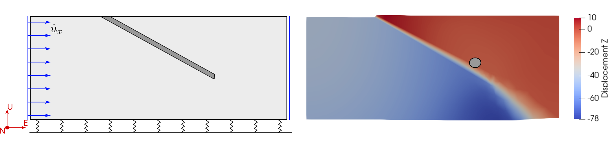
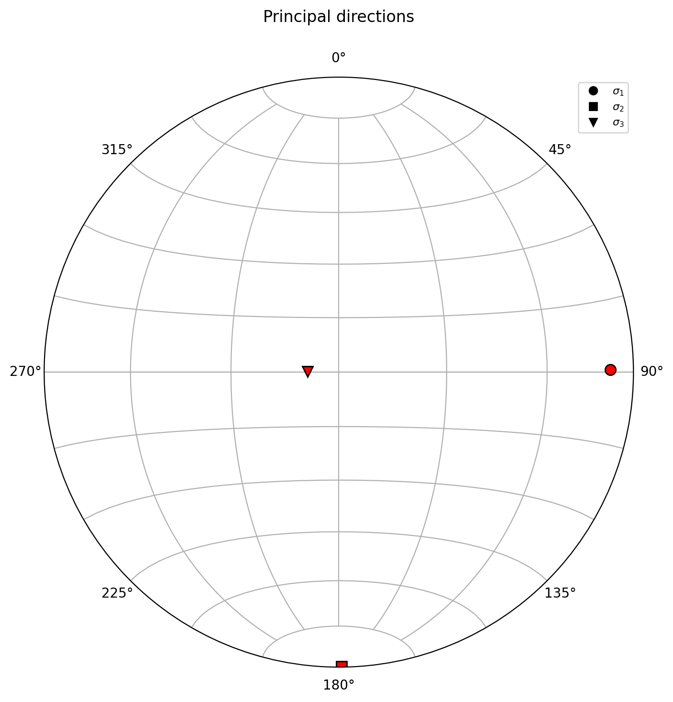
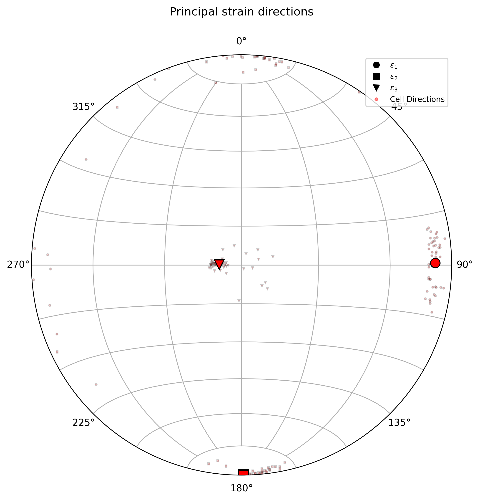

.. _principal-directions:

Principal Directions
====================

This tutorial probes the tensor state (e.g., stress, strain) of a model at a site and plots the
principal directions on a stereonet. The ``principal_directions`` job:

* Extracts a spherical site from the model.
* Averages the tensors of the cells inside.
* Computes the principal directions of the averaged tensor.
* Transforms them to trend and plunge.
* Plots them as :math:`\sigma_1 \leq \sigma_2 \leq \sigma_3`, with
  :math:`\sigma_1` the most compressive.

The ``principal_directions`` job helps identify the tensor orientation at a site and the scatter
of the cells located in the extracted sphere.

The model
---------

The input model is a finite element external simulation of a reverse fault with an elasto-plastic
rheology, loaded in compression. The fault accommodates slip as a weak interface
inside the medium. The figure below shows the geometry and boundary conditions.

   Right: Geometry and boundary conditions of the model. Left: Displacement field
   and the spherical site.

Basic
-----

A minimal configuration only needs the job name, a schema, a model file,
and a site:

.. literalinclude:: ../../../tutorials/1_probing_models/basic.yaml
   :language: yaml

Run it with:

.. code-block:: console

   $ fem2geo a_basic.yaml

The result is a stereonet with the three average principal directions of the
sphere.

   Average principal directions at the selected site.

Styled
------

The styled configuration analyzes de strain tensor, adds a title, figure size, and displays the
per-cell directions as a scatter cloud around the average:

.. literalinclude:: ../../../tutorials/1_probing_models/styled.yaml
   :language: yaml

Run it with:

.. code-block:: console

   $ fem2geo b_styled.yaml

The scatter cloud gives an idea of how coherent the stress field is inside
the sphere. A tight cluster around the average means the principal directions
are consistent across cells; a wide spread suggests the site is located in a
transition.

   Average directions with cell-wise scatter.

Contours instead of scatter
---------------------------

When the site has many cells, scatter points pile up and become hard to read.
Switching to ``contour`` style draws density contours instead:

.. code-block:: yaml

   cell_principals:
     show: true
     style: contour
     levels: 4
     sigma: 2
     linewidth: 1.5

``levels`` controls how many contour lines are drawn; ``sigma`` controls the
kernel bandwidth of the density estimate.

Multiple sites
--------------

To probe several sites at once — for example along a borehole — use the
``sites`` dispatcher. See :ref:`multi_sites` for details.

Understanding the configuration
-------------------------------

Job and schema
^^^^^^^^^^^^^^

.. code-block:: yaml

   job: principal_directions
   schema: adeli

``job`` picks the workflow. ``schema`` maps solver-specific field names.

.. note::

   The ``schema`` tells ``fem2geo`` how to find stress, strain, and other
   fields in your model file, since different solvers store them under
   different names. Built-in schemas are included in ``fem2geo`` to cover the
   common cases. See :ref:`../intro/user_guide` for the full list and how to
   write your own.

Tensor
^^^^^^

By default the job analyses the stress tensor. To analyse a different tensor
(strain, strain rate, etc.), set ``tensor`` at the top level:

.. code-block:: yaml

   tensor: strain

Model input
^^^^^^^^^^^

.. code-block:: yaml

   model: ../data/reverse_fault.vtk

Path is relative to the config file.

Site
^^^^

.. code-block:: yaml

   site: {center: [10000, 5000, -2500], radius: 200}

The site is a sphere. ``center`` places it in model coordinates; ``radius``
controls how many cells are averaged. Smaller radii give a more local
measurement, larger radii average over a wider region.

Plot options
^^^^^^^^^^^^

The ``plot`` block groups everything that affects the figure:

.. code-block:: yaml

   plot:
     title: "Principal stress directions"
     figsize: [9, 9]
     dpi: 300
     legend_size: 8
     legend_loc: "best"
     principals:
       color: "red"
       markersize: 10
     cell_principals:
       show: true
       style: scatter
       markersize: 3
       alpha: 0.3

- ``title``, ``figsize``, ``dpi`` — figure-level.
- ``legend_size`` and ``legend_loc`` — legend scaling and position.
  ``loc`` accepts ``"best"``, ``1``, ``2``, ``3``, ``4``.
- ``principals`` — style for the three average axes. Always drawn.
- ``cell_principals`` — per-cell scatter or density contours. Off by default.

Two cell styles are available:

- ``scatter`` — one marker per cell.
- ``contour`` — kernel density contours. Extra keys ``levels``, ``sigma``,
  ``linewidth``.

Output
^^^^^^

.. code-block:: yaml

   output:
     dir: scatter/
     figure: principal_directions.png
     vtu: extract.vtu

``dir`` is the output folder (created if missing). ``figure`` is the figure
filename. ``vtu`` is optional; when present, the extracted sphere is saved
as a VTU file for inspection in Paraview.

See also
--------

- :ref:`multi_sites`
- :doc:`../intro/theory`
- :doc:`../intro/user_guide`